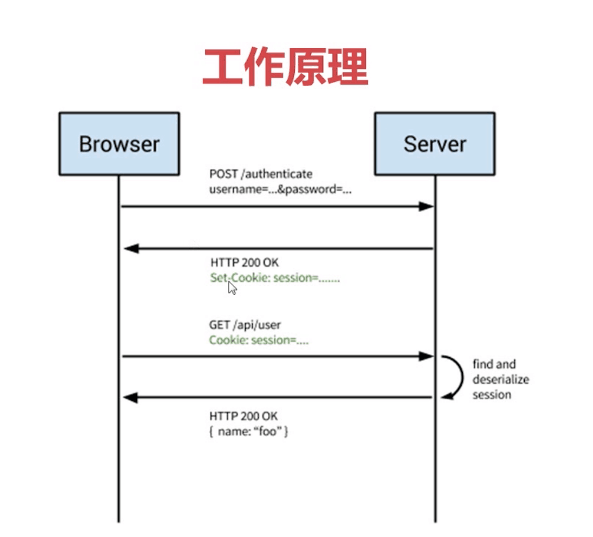
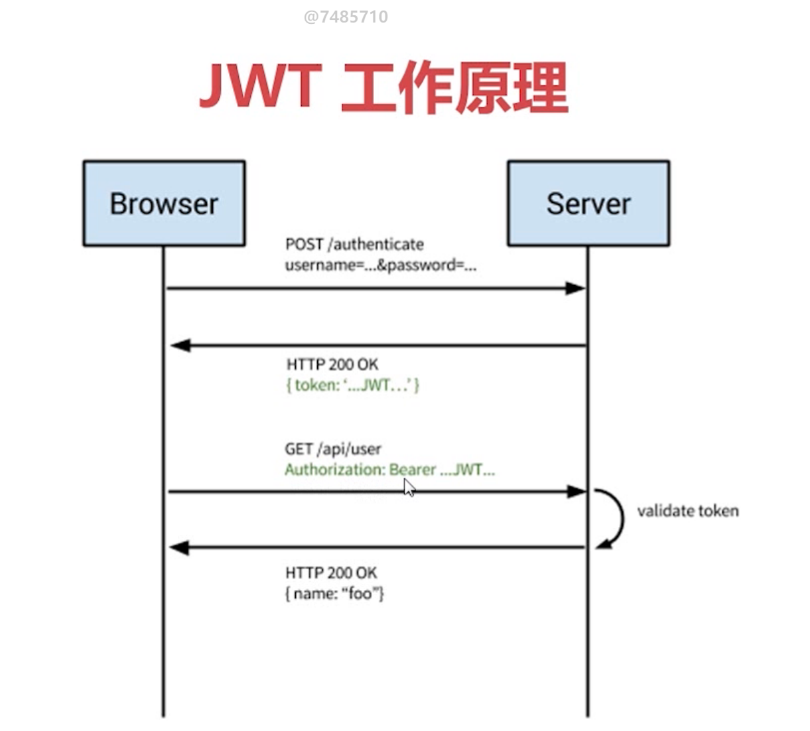

# Node.js仿知乎服务端

## REST

 **Representational State Transfer** \(**REST**\) is a [software architectural](https://en.wikipedia.org/wiki/Software_architecture) style that defines a set of constraints to be used for creating [Web services](https://en.wikipedia.org/wiki/Web_service)

**Re**presentational **S**tate **T**ransfer

Representational: 数据的表示形式 \(json,xml等\)

State:当前状态或数据

Transfer:数据传输

### REST的六个限制

1. Client-Server 
2. Stateless 用户会话信息保存在客户端
3. Cacheability 
4. **Uniform Interface**
5. Layered System
6. Code on Demand （Optional）

### 路由中间件

* 处理不同的url
* 处理不同的http方法
* 解析url上的参数
* koa:prefix,多中间件

### 控制器中间件

* 处理HTTP请求参数
* 处理业务逻辑
* 发送HTTP响应

### HTTP OPTION的作用

* 检测服务器支持的请求方法 \(对应返回头的ALLOW子段\)
* CORS的预检请求

### 数据库**m**ongoDB

> **MongoDB is a general purpose, document-based, distributed database built for modern application developers and for the cloud era. No database is more productive to use.**

* 使用云数据库MongoDB-Atlas
* Mongoose连接MongoDB 
* 创建对应模型的Schema 

Schema主要用于定义MongoDB中集合Collection里文档document的结构,可以理解为mongoose对表结构的定义\(不仅仅可以定义文档的结构和属性，还可以定义文档的实例方法、静态模型方法、复合索引等\)，每个schema会映射到mongodb中的一个collection，schema不具备操作数据库的能力


### JWT 在Koa框架中实现用户的认证与授权



#### Session 优势

* 结合cookie使用,退出登入时,可以让前端清除掉cookie 或者 服务端清除对应的session
* session存在服务端,相对安全

#### Session 劣势

* cookie + session 跨域时需处理
* 分布式部署时 需要多机共享session

#### JWT简介

JSON Web Tokens are an open, industry standard [RFC 7519](https://tools.ietf.org/html/rfc7519) method for representing claims securely between two parties.

JWT由Header,Payload,Signature三部分构成



登入时 服务端将post的信息加密后生成token返回给客户端

客户端再次请求的时候 服务端将token解密后 获取相应信息即可.

node.js中可以引入jsonwebtoken库进行对应操作


### 上传图片时用到的中间件

#### 使用koa-body中间件获取上传的文件

```text
从ctx.request.files.file属性中取出文件
```

#### 使用koa-static中间件生成图片链接

koa-static设置静态服务器的目录,目录下文件可以通过http请求访问

```text
path.basename() 方法返回 path 的最后一部分
ctx.origin:获取Url的来源:protocal和Host部分
图片链接: ctx.origin + '图片目录' + path.basename(file.path)
```

### 关注和粉丝接口

某个用户关注的人和其粉丝为多对多的关系

给每个用户添加数据类型为数组的关注和粉丝子段 ?

由实际情况来看,用户关注的人数据量不会很大,但是某些用户粉丝数可以是百万以上.每个用户的粉丝用数组存储显然占用太大空间.

只需要存用户的关注者列表, 求\(userId='xxx'\)的粉丝时,在数据库中把关注列表包含userId='xxx'的用户筛选出来即可


#### 坑点

用mongoose连接数据库的时候,记得监听一下error事件,不然密码输入错误都不会提示报错.


