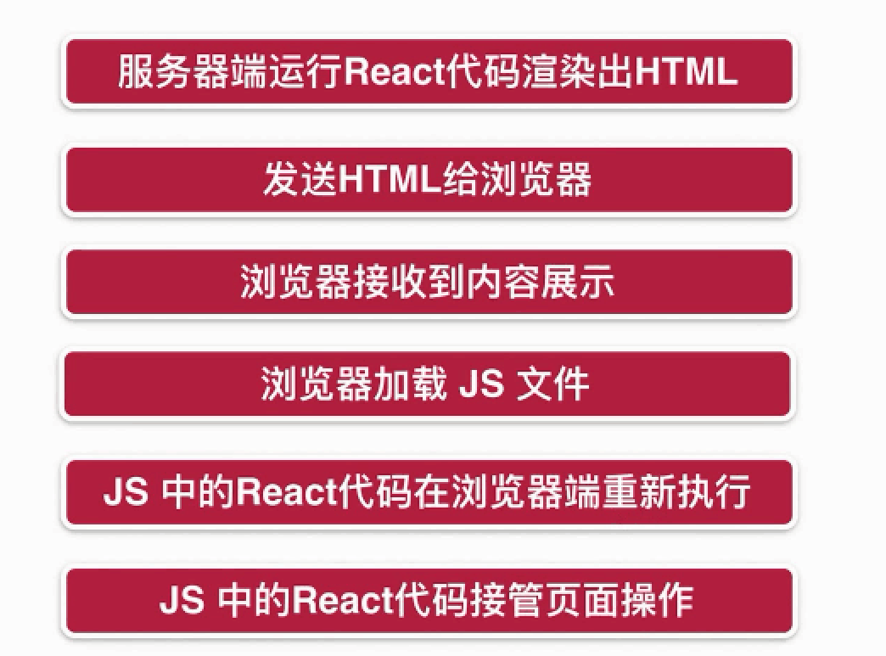

# React SSR 服务端渲染

### 客户端渲染


### 服务端渲染


### CSR和SSR优劣

* **CSR :** 
* React代码在浏览器中运行 消耗的是用户浏览器的性能
* **SSR :**
*  React代码在服务器端运行,消耗的是服务器的性能
* 只发生在第一次进入页面的时候

### 在服务器段编写React组件

* Common Js规范 引入React
* 配置webpack 遇到.js文件 使用babel进行编译
* 安装babel-loader @babel/core 和对应的preset包 \(注意babel 7.0版本兼容性的问题\)

### **Babel**

**babel可以将当前运行平台\(浏览器、node服务器\)尚不支持的下一代或几代js语法编译为当前支持的js语法版本，比如可以把es6 es7和es8的js代码编译为es5的代码**

* **plugin: babel的插件，在6.x版本之后babel必需要配合插件来进行工作**
* **preset: babel插件集合的预设，包含某一部分的插件plugin**
* Plugin 会运行在 Preset 之前,Plugin 会从第一个开始顺序执行,ordering is first to last.Preset 的顺序则刚好相反\(从最后一个逆序执行\)。

### **同构**

**一套React代码,在服务器端执行一次,在客户端也执行一次.**



 为了提供诸如图像、CSS 文件和 JavaScript 文件之类的静态文件，使用 Express 中的 `express.static` 内置中间件函数。

```text
express.static(root, [options])
```

例如，通过如下代码就可以将 `public` 目录下的图片、CSS 文件、JavaScript 文件对外开放访问了：

```text
app.use(express.static('public'))
```

现在，你就可以访问 `public` 目录中的所有文件了：

```text
http://localhost:3000/images/kitten.jpg
http://localhost:3000/css/style.css
http://localhost:3000/js/app.js
http://localhost:3000/images/bg.png
http://localhost:3000/hello.html
```

### **服务端渲染中的路由**

###  **** 


### 引入react-router-dom

* CSR:使用BrowserRouter
* SSR:使用StaticRouter\(不知道浏览器当前的location\(路径\)\),\(只能用户req请求获取location\)

